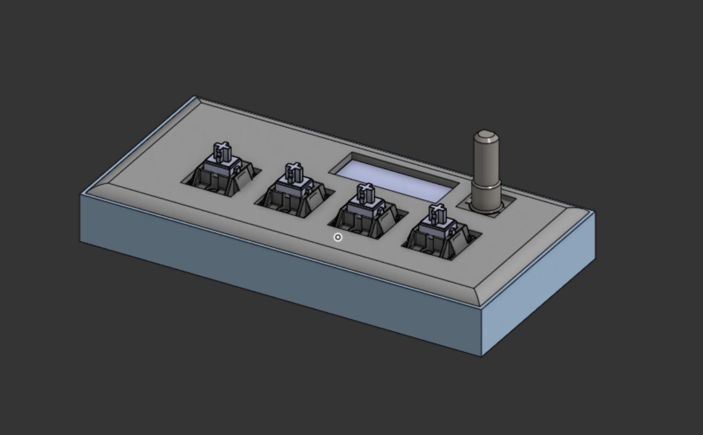
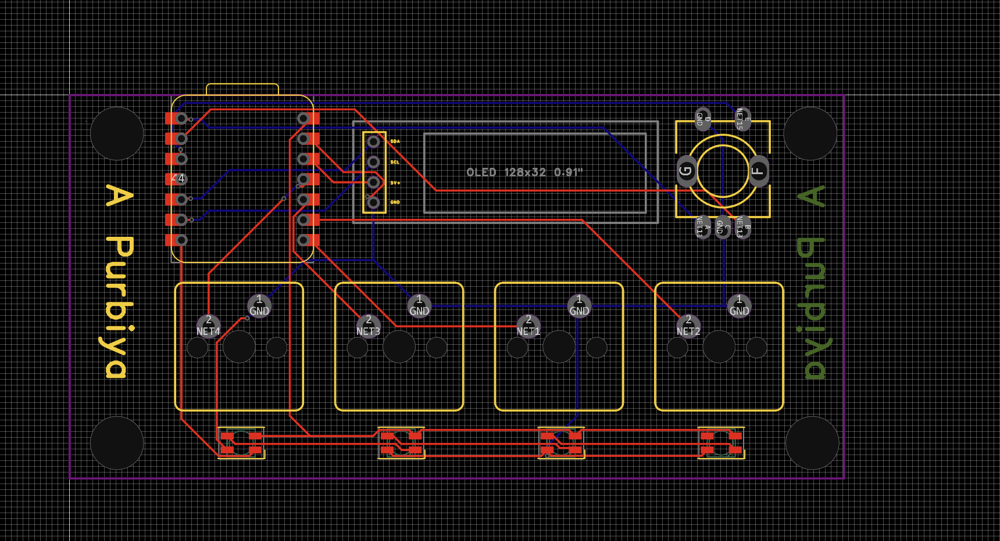

# ✈️ Microsoft Flight Simulator Macro Pad

A custom **macro pad** designed to make playing **Microsoft Flight Simulator**. I am planning on using the screen to have more then 1 macro pre set and by using one of the buttons I can toggel between the different keybinds. For now I plan to use the leds just to light up when I click the button but I would like to figure out a way to synk it with msfs to react to different things happening like when the push to talk is active or when the landing gear is down. I also want to figure out a way to make a wireless but that is a problem for later.

---

##  JLCPCB Order Cart

Below is the screenshot of the JLCPCB cart used to manufacture the PCB I will be needing a grant for the PCB and the kit with all the parts.:

---

##  CAD Model Preview

Here is the 3D model of the macro pad case, the 3D print screws into the case onto the heat set inserts. I have some sorter screws I can use for this.:

I will be **printing this at school**, so I **do not need reimbursement for filament**.

---

## PCB Layout

This is the final PCB design used for the macro pad, I have my name writen on both sides of the silkscreen: 

---
